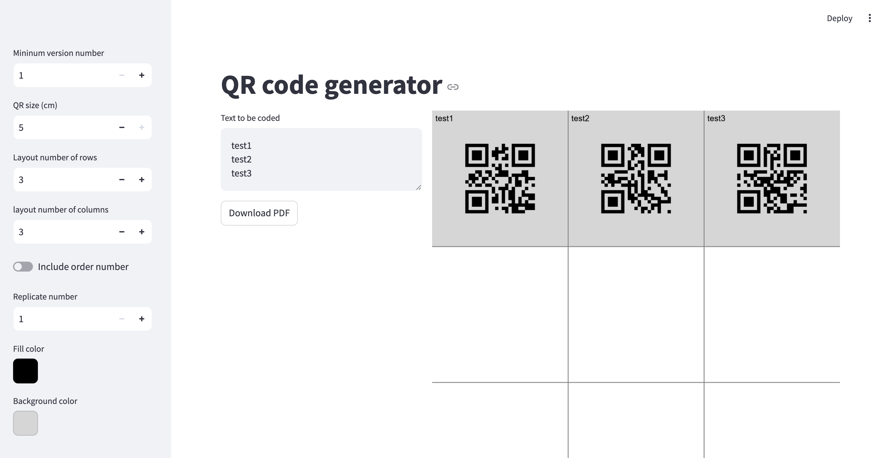

# QR Code Generator


simple QR code generator using python-streamlit.

## Installation

### Python

```bash
git clone https://github.com/takosa/qrgenapp.git
cd qrgenapp
pip install -r requirements.txt
streamlit run app.py
```

### Docker

```bash
git clone https://github.com/takosa/qrgenapp.git
cd qrgenapp
docker build -t qrgenapp .
docker run -p 8501:8501 qrgenapp
```


## Screenshot

